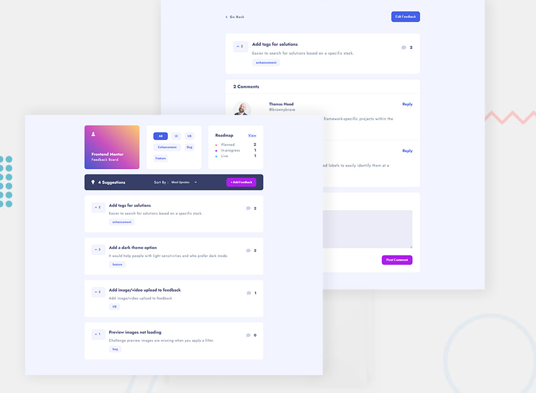

# Feedback App

### Tools

- [React.js](https://reactjs.org/)
- [MongoDB](https://www.mongodb.com/)
- [Axios](https://axios-http.com/)
- [Sweetalert](https://sweetalert2.github.io/)
- [CogoToast](https://cogoport.github.io/cogo-toast/)

### Development

A feedback/suggestion app built using React and connected to Mongo database. The app permits to login an user if an account has been created if not prompts to create one and gives access to create feedbacks to give replies or votes to feedbacks of users already created. Feedbacks can only be edited or deleted by feedback owners via authorization. Moreover the feedbacks can be filtered by votes or comments. The HTTP requests are handled via Axios and the notifications via Sweetalert and CogoToast.
